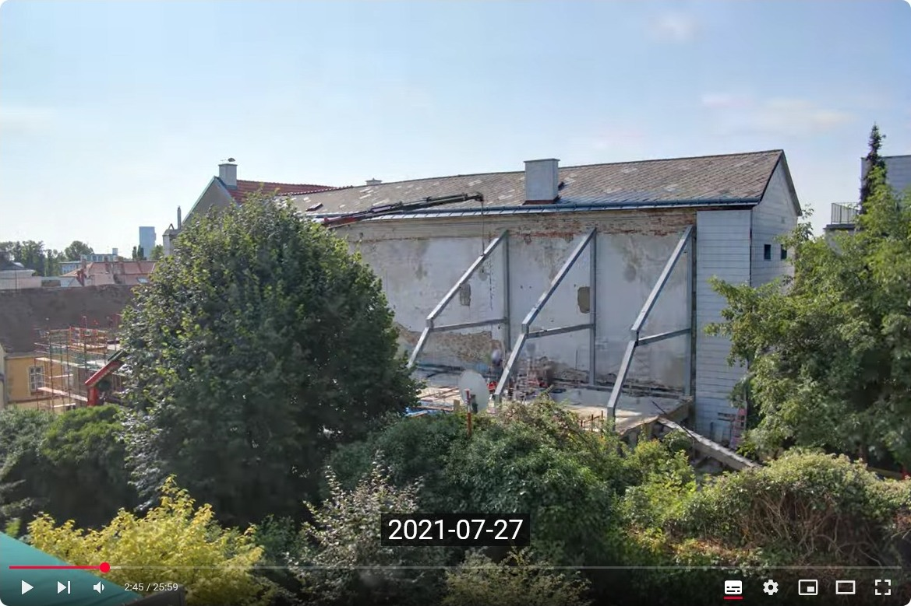

# Time-lapse

This is a description how I shot 389172 photos over the course of 518 days with a Canon 600D and created this 26 minute time-lapse video:

[](https://www.youtube.com/watch?v=L0RZmodfvx4)
[YouTube: 26 minute time-lapse video of our 16 months roof renovation](https://www.youtube.com/watch?v=L0RZmodfvx4)

More about the project in this blog-post: [Watch this 26 minute time-lapse video of our 16 months roof renovation project made from 389172 photos](https://www.leobard.net/blog/2025/01/12/watch-this-26-minute-time-lapse-video-of-our-16-months-roof-renovation-project-made-from-389172-photos/)

This GitHub project **is a documentation** of the production pipeline I used and contains some scripts specifically programmed for this purpose.  

* Folder [concatenate](concatenate/) contains Python scripts to cut and concatenate `.mp4` and `.srt` files. 
* This README.md contains the used [hardware](#used-hardware), [software](#used-software), examples of the used scripts and parameters.
* This project does not contain the JPG images or MP4 files used to create the actual video.

This is not finished software, it does not run out of the box. To use this as a start **to make your own time-lapse**, you need to be able to 

- Install the custom firmware [Magic Lantern](https://www.magiclantern.fm/) on a Canon D-SLR.
- Run software from the command-line.
- Read and edit scripts written in bash and Python.


I am happy to **answer questions** and **add details**. Please ask questions or share your own experiences on **these public channels**:

- [Comments on the blogpost](https://www.leobard.net/blog/2025/01/12/watch-this-26-minute-time-lapse-video-of-our-16-months-roof-renovation-project-made-from-389172-photos/)
- [Comments on the Youtube video](https://youtu.be/L0RZmodfvx4) 
- [Issues on the leobard/timelapse project](https://github.com/leobard/timelapse/issues)


## Goal and approach

The **goal** of this project was to create a **time-lapse video** of a house renovation. It should include **night** and **day shots** with a **high range in exposure detail** to see what is happening.  

As this was my first and probably last multi-month time-lapse in my life, I **approached** the project with an open mind to learn and try out different techniques. Decisions were done according to the philosophy "**good enough and timely is perfect**". Once a step worked good enough, it was documented and applied repeatedly. I did not automate everything, when I thought it was not [worth the time](https://xkcd.com/1205/). As the depicted content only happens once, recording the time-lapse has to work on first try, so stable **quality** of the result and quality checks were essential.

I tried alternative hardware, software, power supplies, camera settings. Here **I document what worked** at the end to keep it short and easy to read.

Combining night and day shots and shots into the sun requires a high range of exposure in one shot. For each frame, I took 3 photos: one normally exposed, one over- and one under-exposed. To combine them into one JPEG, I did not use high dynamic range (HDR) tonemapping as its options require fiddling and it creates halos. Instead I went for the often overlooked **exposure fusion** implemented by [enfuse](https://wiki.panotools.org/Enfuse). You can read about it in [Exposure Fusion:  What is it? How does it Compare to HDR? How Do I Do It?](https://digital-photography-school.com/exposure-fusion-what-is-it-how-does-it-compare-to-hdr-how-do-i-do-it/).

After identifying `ffmpeg` as the best tool to assemble photos to videos and learning that it can also cut, add srt subtitles, and add in-movie titles, I decided that **ffmpeg is the only video manipulation tool for this project**. 

The **date and time of each frame** are stored as **metadata** in separate `.srt` files in parallel to the videos in `.mp4` files. Both `.srt` and `.mp4` files are manipulated in parallel throughout the project.

The resulting video has an optional **subtitle track** showing the current date. The moving sun gives a context of the current time, showing the hour or minute in the subtitles would distract.  At the beginning and end, **titles** are overlayed as images.

I used a combination of Windows OS, Cygwin+Bash, and Python as basis. It is possible to adapt this pipeline for any modern operating system given you are able to install all software and adapt my scripts. 

## Used hardware
- camera: Canon 600D ... *or any Canon SLR which can run the [Magic Lantern](https://www.magiclantern.fm/) camera software*
- lens: Canon kit lens 18-55mm
- power adapter: Canon ACK-E8 for EOS 550D 600D; ASIN : B0037NZ2MI; model number : 4517B006AA; [Amazon Link](https://www.amazon.de/subtel%C2%AE-Qualit%C3%A4ts-Netzteil-Canon-Rebel/dp/B00MUHPO8Y/)
- tripod
- masking tape, paper, pencil
- computer capable of running the software … *I used a Lenovo T470*
- storage of 22 gigabyte of videos during the project … *I used a network drive with backup*
- a dry protected room with a view on the object to film ... *the photos of above project were taken from a nearby rented flat we lived in during planning and construction*

> [!NOTE]
> 
> You may also be able to use other camera hardware if it supports timed shots and exposure brackets. 

## Used software
- [Magic Lantern](https://www.magiclantern.fm/)
- [exiftool](https://exiftool.org/)
- [enfuse](https://wiki.panotools.org/Enfuse) and [EnfuseGUI](https://software.bergmark.com/enfuseGUI/Main.html)
- [ffmpeg](https://www.ffmpeg.org/)
- [python](https://www.python.org/) + [srt](https://github.com/cdown/srt)
- [bash](https://www.gnu.org/software/bash/) on [cygwin](https://www.cygwin.com/) to run [timelapse-prepare-and-run-ffmpeg.sh](https://github.com/leobard/timelapse-prepare-and-run-ffmpeg.sh). See note below.
- [inkscape](https://inkscape.org/) … *optional*

> [!NOTE]
>
> On hindsight I would rewrite [timelapse-prepare-and-run-ffmpeg.sh](https://github.com/leobard/timelapse-prepare-and-run-ffmpeg.sh) in Python to make the floating point additions a lot quicker and remove the dependency on *nix/cygwin+bash.

## Install Magic Lantern

Follow the instructions given on the [Magic Lantern](https://www.magiclantern.fm/) homepage.

## Camera setup

1. Replace camera battery with power adapter connected to power grid.
2. Attach camera to tripod.
3. Point camera in direction of object to film.
4. Try out different zoom, pan, tilt variations until the house is good in frame and enough surroundings are visible to give context.
5. Produce test time-lapse for 48 hours to verify "look". Follow **Camera Settings** and **Weekly processing** checklists and maybe also test the **post-production** steps to make sure everything works.
7. *... repeat until happy with "look", then ...*
8. Mark floor around feet of tripod with masking tape to reset tripod to standard position after vacuuming room and cleaning windows.
9. Draw on paper the elements that should be in the four corners of the picture frame. Stick paper on wall next to camera. In case someone runs into camera, use paper instructions to reset pan/tilt back to standard.
10. Turn off light during night in the room to see the house and not the room reflected in the glass of the window.

## Camera Settings

Lens
- Kit lens 18-55mm
- Zoom: 18mm, wide angle
- Focus: manually focussed on the roof, no autofocus

Camera: picture settings
* Camera mode: AV
* Aperture: fully open maximale Blende/Brennweite eingestellt (am meisten Licht)
* Exposure: -1 EV, shorter exposure with darker picture. Try out different settings and see enfuse results.
* ISO: auto

Camera: settings
* Clock: set correct time every week and remind yourself to set clock on winter/summertime changes
* Display brightness: minimal
* Recording: image review: off
* Auto-Power-Off: off
* Picture quality: medium resolution 3456 × 2304, high quality, resulting in about 3MB per picture with aspect ratio 1,50
* Picture format: JPEG
* Max Iso on Auto: 3200

Camera: Magic Lantern Settings
- [Magic Lantern timelapse tutorial](https://www.youtube.com/watch?v=1mB_hv3b05Y)
* [Intervalometer](https://wiki.magiclantern.fm/userguide#intervalometer), [detailed hints](https://www.magiclantern.fm/forum/index.php?topic=12584.0)
	* Photo every: 5 Minutes
* Bracket:
	* Frames: 3
	* EV Increment: 2 EV
	* Sequence: 0 - + -- ++
	* 2-second delay: auto
	* Iso shifting: off
* Start: on Power on


> [!NOTE]
>
> You **may** set the Camera to combine **mirror lock** and **intervalometer** in Magic Lantern to reduce the movements and wear & tear. But if the sun shines on the shutter for many months, that may be bad, so you **probably shouldn't**. I didn't.


## Weekly processing of photos to videos
I did this every week on **Sunday** mid-day when no work happens on the filmed object (construction site). 

**Approach**: The time-lapse for each week consisted first of about 6048 photos each week, combined with **enfuse** to 2016 frames, around 20.000 MB of data. This was compressed using **ffmpeg** into 320MB of full resolution 3456 × 2304  video and 81 MB of 1620 × 1080 video. The MP4 compression of 50:1 and deleting the source photos kept the storage demands acceptable. Having only 3 files per week made copying/backup easier. The resulting video files can be played in [VLC](https://www.videolan.org/).

At the camera:

1. Switch SD cards … *I used two cards with the same MagicLantern settings on each*
2. Verify pan, tilt, zoom, and focus are still ok by looking through viewfinder and comparing to paper on wall created during Camera Setup step 8. 
3. Verify window is clean, otherwise clean it.

On the computer:
1. Move photos from SD to computer
2. Go through all nights and delete all photos were someone turned on the light in the camera room and the room is visible in the window reflection. *Hint: on the last days of above video we included them in the time-lapse intentionally to showcase us carrying our moving boxes from where the camera is to where the camera points.*
3. You now have 3 photos (1 × normal, 1 × under-exposed, 1 × over-exposed) every 5 minutes. The number of photos is dividable by 3.
4. Rename files from Canon "IMG_" format to ISO date-times using [**exiftool**](https://exiftool.org/):

   1. `exiftool "-FileName<${datetimeoriginal}${subsectimeoriginal}%-c.%e" -d %Y-%m-%d_%H%M%S .`
   2. The files are now named something like `2022-10-01_16102506.jpg`

5. Run **enfuse**.

   1. I used [enfuse](https://wiki.panotools.org/Enfuse) with [EnfuseGUI](https://software.bergmark.com/enfuseGUI/Main.html). 
   2. I found the **standard settings** create good results:
      1. exp: 1 
      2. cont: 0 
      3. sat: 0.2 
      4. mu: 0.5 
      5. Sigma:  0.2 

   3. Hint: enfuse took about 5 seconds to combine 3 photos into 1.
   4. The resulting filename pattern is `2022-10-01_16102506-2022-10-01_16102593.jpg`

6. Combine the photos into a 1080p and full resultion `.mp4` video and `.srt` metadata file to store the date and time of each frame.

   1. I used [timelapse-prepare-and-run-ffmpeg.sh](https://github.com/leobard/timelapse-prepare-and-run-ffmpeg.sh). 

   2. The result are three files: 
      ```
      video.mp4
      video1080.mp4
      subtitles.srt
      ```

7. Rename the files to a pattern that works for managing the files for months and postprocessing. I used  "\<from date\> to \<to date\>" to indicate which days are contained in the video:
   ```
   2021-06-06 to 12 timelapse.mp4
   2021-06-06 to 12 timelapse_1080.mp4
   2021-06-06 to 12 timelapse_1080.srt
   ```
8. Collect the files in a folder for further post-production, I used `input/`.
9. Delete the source photos.


> [!NOTE]
> I used Monday-Saturday shots and didn't stitch together the Sundays from two weeks. The approach can be extended in principle to work also with Sundays included, then the cutting & concatenating of Sundays needs to be added by you.
>
> On hindsight, I would rewrite [timelapse-prepare-and-run-ffmpeg.sh](https://github.com/leobard/timelapse-prepare-and-run-ffmpeg.sh) in Python to make the floating point additions a lot quicker and remove the dependency on *nix/cygwin + bash.
>
> On hindsight, calling **enfuse** via command-line script would have been more useful instead of the GUI.


## Post-Production

Once all photos are taken and stored as `.mp4` and `.srt` files, the following is done to create a time-lapse video.

> [!NOTE]
> I first finished all this for the 1080p version of the video using the smaller file sizes. This allowed experimenting and learning in quicker iterations. Once the 1080p version was complete, I repeated all steps for the full resolution video. 
>
> In the documentation, I try to document both. If you only want the full resolution video, skip the parts with the `_1080.mp4`  video files. 
>
> The `_1080.srt`  **subtitle** files are also valid for the full resolution `.mp4` files. The filename contains  `_1080` so that VLC will use the `.srt` file as the filenames of both `.mp4` files are substrings of the `.srt` filename. If you open any of the mp4s, the subtitles will "just work".


### Identify interesting days

1. Go through all weeks and identify interesting days.

2. I took note within a spreadsheet and then copied the dates into `config/interesting_days.txt` . For each day, the file contains one line. Example:
   ```
   2021-06-12
   2021-06-17
   2021-06-18
   ```

### Cut weeks into interesting days

Install python, [setup a venv](https://docs.python.org/3/tutorial/venv.html),  install the requirements ([srt](https://github.com/cdown/srt)) using 

```
python3 -m pip install srt
```

The next steps require the python scripts of this project, see sub-folder [concatenate/](concatenate/). 

Create two output folders:

```
# for the 1080p resolution
mkdir output_1080/

# for the full resolution
mkdir output/      
```

Create a script calling the `cut-days.py` for all weekly videos. I created the script as `cut_all_weeks.bat` as follows:

1. Create a list of all `.srt` files within the input folder, in Windows this is done using 
   `cd input`
   `dir *.srt /B > list_srt.txt`
2. Edit the list_srt.txt file and, for example using Notepad++, do a regex replace `(.*)\.srt` with `python "concatenate/cut-days.py" "input/$1.srt" "input/$1.mp4" "config/interesting_days.txt" "output"` , save result to `cut-days.bat`. Adapt this to create both the full and the _1080 version.

Example lines in the `cut_all_weeks.bat` script are:

```
# here are two lines for one week:
# 1080p resolution
python concatenate/cut-days.py "input/2021-06-06 to 12 timelapse_1080.srt" "input/2021-06-06 to 12 timelapse_1080.mp4" "config/interesting_days.txt" "output_1080"
# full resolution
python concatenate/cut-days.py "input/2021-06-06 to 12 timelapse_1080.srt" "input/2021-06-06 to 12 timelapse.mp4" "config/interesting_days.txt" "output"

# ... continue now with all weeks
```

Run the script `cut_all_weeks.bat`.

This will create two folders with the interesting days in each folder. 

Example: `output/` should now contain:

```
2021-06-12.mp4
2021-06-12.srt
2021-06-17.mp4
2021-06-17.srt
2021-06-18.mp4
2021-06-18.srt
```

Do a **quality check**: the number of files in `dir output\*.mp4` is the same as in `config\interesting_days.txt`

> [!TIP]
>
> I did a "special effect" of extending certain frames on the last day to last longer. See below "[Optional: extend frames on a day](#optional-extend-frames-on-a-day)" for more.


### Add credits and titles

As all video editing in this project is with `ffmpeg`, credits and titles are added as file overlays. To have sharp credits, they were written in Inkscape as SVG and then saved into PNG files matching the exact resolution needed within the frame. 

After some fiddling, the following dimensions and positions of titles looked good on this video. 

| What         | 1080p | full |
| ------------ | ----- | ---- |
| **Video**    |       |      |
| width        | 1620  | 3456 |
| height       | 1080  | 2304 |
| **Subtitle** |       |      |
| width        | 1432  | 3055 |
| height       | 211   | 451  |
| x-position   | 89    | 190  |
| y-position   | 765   | 1633 |

Create PNG files for each title. 

- I used Inkscape to paint the titles. See [titles/dedication.svg](titles/dedication.svg) for the resulting SVG file. I added helper objects and layers into this file for easier editing.
- The resulting titles are stored in titles/1080 and titles/2304 folder.

The `ffmpeg` calls to add them to the 1080p version:


```
ffmpeg -i "output_1080/2021-06-12.mp4" -i "titles/1080/05RoofRenovationTimelapse.png" -filter_complex "[0][1]overlay=x=89:y=765:enable='between(t,9.5,11.520)'" output_1080/2021-06-12_titler.mp4
ffmpeg -i "output_1080/2021-06-17.mp4" -i "titles/1080/05RoofRenovationTimelapse.png" -i "titles/1080/10dedykowane-center.png" -filter_complex "[0][1]overlay=x=89:y=765:enable='between(t,0.0,2.500)'[out];[out][2]overlay=x=89:y=765:enable='between(t,9.5,11.520)'" output_1080/2021-06-17_title.mp4
ffmpeg -i "output_1080/2021-06-18.mp4" -i "titles/1080/10dedykowane-center.png" -i "titles/1080/20dedication-center.png" -filter_complex "[0][1]overlay=x=89:y=765:enable='between(t,0.0,2.500)'[out];[out][2]overlay=x=89:y=765:enable='between(t,9.5,11.520)'" output_1080/2021-06-18_title.mp4
ffmpeg -i "output_1080/2021-06-21.mp4" -i "titles/1080/20dedication-center.png" -i "titles/1080/30ebo-center.png" -filter_complex "[0][1]overlay=x=89:y=765:enable='between(t,0.0,2.500)'[out];[out][2]overlay=x=89:y=765:enable='between(t,9.5,11.520)'" output_1080/2021-06-21_title.mp4
ffmpeg -i "output_1080/2021-06-24.mp4" -i "titles/1080/30ebo-center.png" -filter_complex "[0][1]overlay=x=89:y=765:enable='between(t,0.0,2.500)'" output_1080/2021-06-24_title.mp4
rem 2022-09-30 duration=11.520000
rem 2022-10-01 duration=23.680000
ffmpeg -i "output_1080/2022-09-30.mp4" -i "titles/1080/80ingridleo.png" -filter_complex "[0][1]overlay=x=89:y=765:enable='between(t,9.5,11.520)'" output_1080/2022-09-30_title.mp4
ffmpeg -i "output_1080/2022-10-01.mp4" -i "titles/1080/80ingridleo.png" -filter_complex "[0][1]overlay=x=89:y=765:enable='between(t,0.0,2.500)'" output_1080/2022-10-01_title.mp4
```

In full version


```
ffmpeg -i "output/2021-06-12.mp4" -i "titles/2304/05RoofRenovationTimelapse.png" -filter_complex "[0][1]overlay=x=190:y=1633:enable='between(t,9.5,11.520)'" output/2021-06-12_title.mp4
ffmpeg -i "output/2021-06-17.mp4" -i "titles/2304/05RoofRenovationTimelapse.png" -i "titles/2304/10dedykowane-center.png" -filter_complex "[0][1]overlay=x=190:y=1633:enable='between(t,0.0,2.500)'[out];[out][2]overlay=x=190:y=1633:enable='between(t,9.5,11.520)'" output/2021-06-17_title.mp4
ffmpeg -i "output/2021-06-18.mp4" -i "titles/2304/10dedykowane-center.png" -i "titles/2304/20dedication-center.png" -filter_complex "[0][1]overlay=x=190:y=1633:enable='between(t,0.0,2.500)'[out];[out][2]overlay=x=190:y=1633:enable='between(t,9.5,11.520)'" output/2021-06-18_title.mp4
ffmpeg -i "output/2021-06-21.mp4" -i "titles/2304/20dedication-center.png" -i "titles/2304/30ebo-center.png" -filter_complex "[0][1]overlay=x=190:y=1633:enable='between(t,0.0,2.500)'[out];[out][2]overlay=x=190:y=1633:enable='between(t,9.5,11.520)'" output/2021-06-21_title.mp4
ffmpeg -i "output/2021-06-24.mp4" -i "titles/2304/30ebo-center.png" -filter_complex "[0][1]overlay=x=190:y=1633:enable='between(t,0.0,2.500)'" output/2021-06-24_title.mp4
rem 2022-09-30 duration=11.520000
rem 2022-10-01 duration=23.680000
ffmpeg -i "output/2022-09-30.mp4" -i "titles/2304/80ingridleo.png" -filter_complex "[0][1]overlay=x=190:y=1633:enable='between(t,9.5,11.520)'" output/2022-09-30_title.mp4
ffmpeg -i "output/2022-10-01.mp4" -i "titles/2304/80ingridleo.png" -filter_complex "[0][1]overlay=x=190:y=1633:enable='between(t,0.0,2.500)'" output/2022-10-01_title.mp4
```

> [!NOTE]
>
> During the night, the credits are better visible against the dark background and they distract less as there is less "action". So the credits are added during night times. 
>
> As the video is already 29 minutes long and "slow TV", no extra time and video content was added to the video as background for the credits, they are overlaid on the time-lapse. That makes the time-lapse self-contained and doesn't add artificial footage/screens at the beginning and end.

Recommended reading on using overlays:

- How to Add a Transparent Overlay on a Video using FFmpeg
  https://creatomate.com/blog/how-to-add-a-transparent-overlay-on-a-video-using-ffmpeg
- https://stackoverflow.com/questions/42943805/ffmpeg-is-it-possible-to-overlay-multiple-images-over-a-video-at-specified-inte

- https://stackoverflow.com/questions/65148191/ffmpeg-overlay-multiple-images-to-a-video
- There is also a relative positioning of images which could be used: `-filter_complex [0][1]overlay=x=(main_w-overlay_w)/2:y=(main_h-overlay_h)/2`

This step **creates new files** for the **days with visible credits**. In the next step, these filenames should be used instead of the default `2021-06-12.mp4`

```
output/2021-06-12_title.mp4
output/2021-06-17_title.mp4
...
```


### Concatenate the days

> [!IMPORTANT]
>
> Do the following **within the output folder**!
>
>  `cd output` 
>
> This makes the commands shorter and they can be run for both the 1080p and 2304p version of the videos.

Create a list of all the videos

`dir /B ????-??-??.mp4 > days-videos-diroutput.txt`

Take contents of `days-videos-diroutput.txt` and create a new file `days-videos.txt` to look like this, for example using Notepad++ and find/replace:

```
file '2021-06-12.mp4'
file '2021-06-17.mp4'
file '2021-06-18.mp4'
```

> [!NOTE]
>
> If you created videos with titles as overlays in the previous step, now you need to hand-edit `days-videos.txt` to include `2021-06-12_title.mp4` and not `2021-06-12.mp4`: 
> `file '2021-06-12_title.mp4'`

Concatenate the videos of the days using ffmpeg:

`ffmpeg -f concat -i days-videos.txt -c copy -scodec copy timelapse.mp4`

Create a list of all SRT subtitle files:

`dir /B ????-??-??.srt > days-srt.txt`

Concatenate the subtitles of the days using the `srt-concatenate.py` script:

`python ..\concatenate\srt-concatenate.py "days-srt.txt" "timelapse_frames.srt"`

Limit subtitles to full hours (optional)

`python ..\concatenate\srt-to-hours.py "timelapse_frames.srt" "timelapse_hours.srt"`

Limit subtitles to full days (recommended for this project)

`python ..\concatenate\srt-to-hours.py "timelapse_frames.srt" "timelapse_days.srt" --days`

Do a **quality check**:
- Compare the last line of the subtitle file `tail timelapse_days.srt`
- … with the duration of the video `ffprobe -i timelapse.mp4 -show_entries format=duration -sexagesimal`
- … both subtitle and video file should have the same duration.

Combine video and subtitles

`ffmpeg -i "timelapse.mp4" -i "timelapse_days.srt" -c:s mov_text -metadata:s:s:0 language=en -metadata:s:s:0 title=Date "timelapse_wsubs.mp4"`

Whoop Whoop, you are done.


> [!NOTE]
>
> Do this for the 1080 resolution, for the full resolution, or for both, depending on your needs.
>

## Result

You end up with three files in `output/`

`timelapse.mp4` … video file

`timelapse_days.srt` … subtitle file, showing days

`timelapse_wsubs.mp4` … a combined video+subtitle file (with a subtle quality loss in video)

> [!NOTE]
>
> I suspect the last combination of video and subtitles does a recoding and compression of the mp4 video stream resulting in a quality loss. The concatenation steps before worked fast and did not recode the video. Hence I used the `timelapse.mp4` as source file for the YouTube upload and uploaded the `timelapse_days.srt` subtitles directly to YouTube.

## Optional: extend frames on a day

For the last day, I kept and did not delete the original enfused photos of the day as I knew I had some special moments there. 

I did the following for both `.mp4` and `.srt` files:

1. Cut the day into pieces, 
2. Create 2-second videos (instead of 0.04 seconds) of certain photos of certain frames
3. Add everything together


**Cut the day into pieces**

The script `concatenate/cut-days.py` supports time-stamps, too. 

Example `config/interesting_intraday_2022-10-01.txt`

``` 
2022-10-01 00:00
2022-10-01 16:17
2022-10-01 16:20
2022-10-01 16:25
2022-10-01 16:27
2022-10-01 16:37
```

Cut into intra-day segments:

````
mkdir output-2022-10-01
python concatenate/cut-days.py "output/2022-10-01.srt" "output/2022-10-01.mp4" "config/interesting_intraday_2022-10-01.txt" "output-2022-10-01"
````


**Create 2-second videos from photos** 

```
# 1080 resolution
ffmpeg -loop 1 -framerate 25 -t 2 -i "input/2022-10-01_16165537-2022-10-01_16165625_pose.jpg" -vf scale=-4:1080 -c:v libx264 -pix_fmt yuv420p "output-2022-10-01/2022-10-01_16165537_pose_1080.mp4"

# full resolution
ffmpeg -loop 1 -framerate 25 -t 2 -i "input/2022-10-01_16165537-2022-10-01_16165625_pose.jpg" -c:v libx264 -pix_fmt yuv420p "output-2022-10-01/2022-10-01_16165537_pose.mp4"

```

Create a still SRT for the same file, edit `output-2022-10-01/2022-10-01_16165537_pose_1080.srt` and write manually:

```
1
00:00:00,000 --> 00:00:02,000
2022-10-01 16:16
```


**Add everything together**

Create `days-videos.txt` and `days-srt.txt` files for the videos you just created. **This is described above!**

Concatenate the video and srt:

```
ffmpeg -f concat -i output-2022-10-01/days-videos.txt -c copy -scodec copy output-2022-10-01/2022-10-01.mp4
python concatenate\srt-concatenate.py output-2022-10-01/days-srt.txt output-2022-10-01/2022-10-01.srt
```

Copy the resulting output-2022-10-01/2022-10-01.mp4 and output-2022-10-01/2022-10-01.srt back into output/ (overwriting what is there) and continue as described above.

> [!TIP]
>
> Recommended reading: https://superuser.com/questions/1627299/how-to-add-still-image-before-and-after-a-video-for-a-specific-duration

## Credits

Dedykowane Januszowi Pytlowi i Adamowi Kukli, którzy to zbudowali. 

Dedicated to Janus Pytel and Adam Kukle, who built it.

Thanks to Ebo Rose for technical advice for the time-lapse.

A project by Leo "[Leobard](https://www.leobard.net)" Sauermann and Ingrid Brunner-Sauermann.